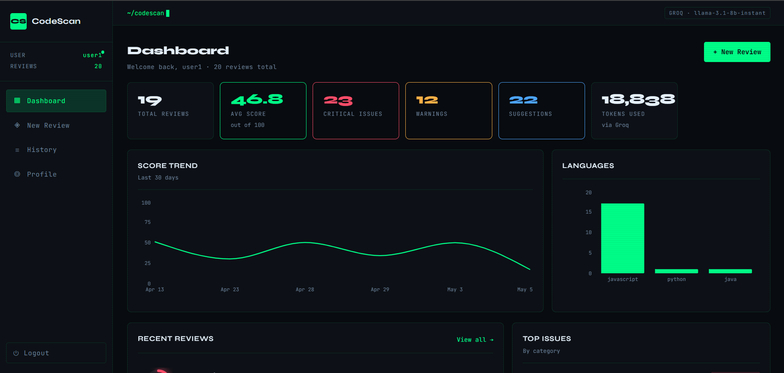
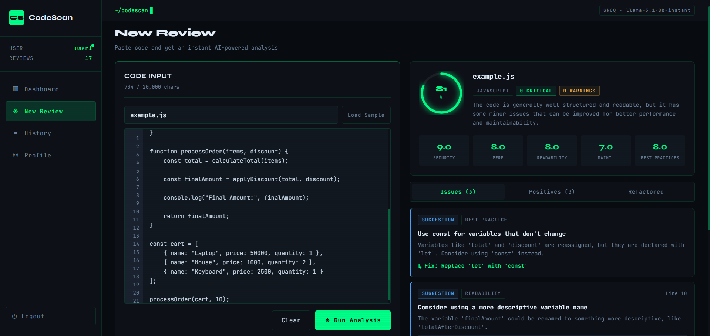

# CodeScan — AI Code Reviewer

> AI-powered code review using Groq LLM · Built with Node.js, React, and MongoDB


---

## Overview

CodeScan is a full-stack application that lets developers submit code files for instant AI review. It detects security vulnerabilities, performance issues, readability problems, and best-practice violations — scored across five dimensions and stored in a personal history with dashboard analytics.

**Key features:**

- Paste any code file and receive a structured AI review in seconds
- Scores across Security, Performance, Readability, Maintainability, and Best Practices
- Issues ranked by severity: Critical, Warning, Suggestion
- Personal review history with search, filtering, favorites, and tags
- Dashboard with score trends, language breakdown, and top issue categories
- JWT authentication with secure password hashing
- Refactored code snippets suggested by the AI

---

## Project Structure

```
codescan/
├── backend/          # Node.js + Express REST API
└── frontend/         # React + Vite SPA
```

---

## 🌐 Live Deployment

| Service | Link |
|----------|------|
| Frontend App | https://ai-code-reviewer-pi-tawny.vercel.app/ |
| Backend API | https://ai-code-reviewer-6ulv.onrender.com |
| GitHub Repository | https://github.com/Tarun-7092/ai-code-reviewer |

> **Note:**  
> Backend services are hosted on Render free tier and may take 30–60 seconds to wake up on the first request.  
> You can also manually activate the backend by opening the Backend API link before using the application.

---

## 🖼️ Screenshots

### Dashboard


### AI Reviewer



---

## 🎥 GIF Previews

### AI Reviewer Demo


---

## Backend

### Tech Stack

| Layer | Technology |
|---|---|
| Runtime | Node.js 18+ (ESM) |
| Framework | Express 4 |
| Database | MongoDB via Mongoose |
| AI | Groq SDK (llama3-70b-8192) |
| Auth | JWT + bcryptjs |
| Logging | Winston |

### Folder Structure

```
backend/src/
├── config/
│   ├── db.js                 # MongoDB connection
│   └── env.js                # Environment config + validation
├── controllers/
│   ├── auth.controller.js    # Register, login, profile, password
│   ├── review.controller.js  # Submit code for AI review
│   ├── history.controller.js # View, favorite, tag, delete reviews
│   └── dashboard.controller.js # Analytics aggregations
├── routes/
│   ├── auth.routes.js
│   ├── review.routes.js
│   ├── history.routes.js
│   └── dashboard.routes.js
├── middleware/
│   ├── auth.middleware.js    # JWT protect + role restrict
│   └── error.middleware.js   # Global error + 404 handlers
├── models/
│   ├── user.model.js         # User schema with bcrypt hooks
│   └── review.model.js       # Review + embedded issues schema
├── services/
│   ├── ai.service.js         # Groq API integration + prompts
│   └── history.service.js    # Review CRUD operations
├── utils/
│   ├── jwt.js                # Sign, verify, extract token
│   └── logger.js             # Winston logger (dev + prod)
├── app.js                    # Express app setup
└── server.js                 # Entry point, DB connect, startup
```

### Setup

**1. Install dependencies**

```bash
cd backend
npm install
```

**2. Configure environment**

```bash
cp .env .env.local
# Edit .env with your values
```

```env
PORT=5000
NODE_ENV=development
CORS_ORIGIN=http://localhost:3000

MONGO_URI=mongodb://localhost:27017/ai-code-reviewer

JWT_SECRET=your_super_secret_jwt_key_change_this
JWT_EXPIRES_IN=7d

GROQ_API_KEY=your_groq_api_key_here
GROQ_MODEL=llama3-70b-8192
```

Get a free Groq API key at [console.groq.com](https://console.groq.com).

**3. Run**

```bash
npm run dev     # development with nodemon
npm start       # production
```

The API will start at `http://localhost:5000`. You should see:

```
✅ MongoDB connected
✅ Groq AI connected
🚀 AI Code Reviewer API running on http://localhost:5000
```

### API Reference

All protected routes require an `Authorization: Bearer <token>` header.

#### Auth

| Method | Endpoint | Auth | Description |
|---|---|---|---|
| POST | `/api/auth/register` | ❌ | Create a new account |
| POST | `/api/auth/login` | ❌ | Login and receive JWT |
| GET | `/api/auth/me` | ✅ | Get current user |
| PATCH | `/api/auth/update-profile` | ✅ | Update name / avatar |
| PATCH | `/api/auth/change-password` | ✅ | Change password |

#### Review

| Method | Endpoint | Auth | Description |
|---|---|---|---|
| POST | `/api/review` | ✅ | Submit code for AI review |

Request body:
```json
{
  "fileName": "auth.js",
  "code": "// your code here..."
}
```

#### History

| Method | Endpoint | Auth | Description |
|---|---|---|---|
| GET | `/api/history` | ✅ | Paginated list of reviews |
| GET | `/api/history/:id` | ✅ | Full review detail |
| PATCH | `/api/history/:id/favorite` | ✅ | Toggle favorite |
| PATCH | `/api/history/:id/tags` | ✅ | Update tags |
| DELETE | `/api/history/:id` | ✅ | Delete a review |

Query params for `GET /api/history`: `page`, `limit`, `language`, `grade`, `search`

#### Dashboard

| Method | Endpoint | Auth | Description |
|---|---|---|---|
| GET | `/api/dashboard` | ✅ | Full analytics for current user |

Dashboard response includes: summary stats, language breakdown, score trend (30 days), recent reviews, and top issue categories.

### Scoring System

The overall score (0–100) is computed as a weighted average of five dimensions:

| Dimension | Weight |
|---|---|
| Security | 30% |
| Performance | 20% |
| Readability | 20% |
| Maintainability | 20% |
| Best Practices | 10% |

Letter grades: A+ (≥90) · A (≥80) · B (≥70) · C (≥60) · D (≥50) · F (<50)

---

## Frontend

### Tech Stack

| Layer | Technology |
|---|---|
| Framework | React 18 |
| Build | Vite 5 |
| Routing | React Router 6 |
| Charts | Recharts |
| HTTP | Axios |
| Styling | CSS Modules |

### Folder Structure

```
frontend/src/
├── components/
│   ├── layout/
│   │   ├── Layout.jsx          # Sidebar + topbar shell
│   │   └── Layout.module.css
│   └── ui/
│       ├── index.jsx           # Card, Badge, ScoreRing, Button, Input, etc.
│       └── ui.module.css
├── context/
│   └── AuthContext.jsx         # Global auth state + login/register/logout
├── pages/
│   ├── LoginPage.jsx           # Login form
│   ├── RegisterPage.jsx        # Register form
│   ├── DashboardPage.jsx       # Analytics dashboard
│   ├── ReviewPage.jsx          # Code editor + live AI review
│   ├── HistoryPage.jsx         # Filterable review grid
│   ├── ReviewDetailPage.jsx    # Full review breakdown
│   └── ProfilePage.jsx         # Profile + password settings
├── services/
│   └── api.js                  # Axios instance + all API calls
├── styles/
│   └── global.css              # CSS variables, reset, animations
├── App.jsx                     # Router + protected/guest routes
└── main.jsx                    # React entry point
```

### Setup

**1. Install dependencies**

```bash
cd frontend
npm install
```

**2. Run**

```bash
npm run dev     # → http://localhost:3000
```

The Vite dev server proxies all `/api` requests to `http://localhost:5000`, so no CORS configuration is needed during development.

**3. Build for production**

```bash
npm run build
npm run preview
```

### Pages

| Page | Route | Description |
|---|---|---|
| Login | `/login` | JWT authentication |
| Register | `/register` | New account creation |
| Dashboard | `/dashboard` | Score trend, language breakdown, recent activity |
| New Review | `/review` | Code editor with line numbers, real-time AI analysis |
| History | `/history` | Searchable grid of all past reviews |
| Review Detail | `/history/:id` | Full issue list, dimension scores, code preview, tags |
| Profile | `/profile` | Update name, change password |

### Design

The UI uses a **terminal dark aesthetic** — dark backgrounds (`#080b0f`), green accent (`#00ff88`), monospace typography (JetBrains Mono + Syne), and a subtle scanline overlay. All components are built with CSS Modules and no external UI library.

---

## Running Both Together

From the project root, open two terminals:

```bash
# Terminal 1 — backend
cd backend && npm run dev

# Terminal 2 — frontend
cd frontend && npm run dev
```

Then open [http://localhost:3000](http://localhost:3000), register an account, and submit your first review.

---

## Environment Variables Reference

### Backend (`backend/.env`)

| Variable | Required | Default | Description |
|---|---|---|---|
| `PORT` | No | `5000` | Server port |
| `NODE_ENV` | No | `development` | Environment mode |
| `CORS_ORIGIN` | No | `http://localhost:3000` | Allowed CORS origin |
| `MONGO_URI` | **Yes** | — | MongoDB connection string |
| `JWT_SECRET` | **Yes** | — | Secret for signing JWTs |
| `JWT_EXPIRES_IN` | No | `7d` | JWT token lifetime |
| `GROQ_API_KEY` | **Yes** | — | Groq API key |
| `GROQ_MODEL` | No | `llama3-70b-8192` | Groq model to use |

---

## Supported Languages

CodeScan automatically detects the language from the file extension. Supported languages include:

JavaScript · TypeScript · Python · Ruby · Java · Go · Rust · C · C++ · C# · PHP · Swift · Kotlin · SQL · HTML · CSS · SCSS · Bash · YAML · JSON · Vue · Svelte · Terraform · Dockerfile

---

## License

MIT